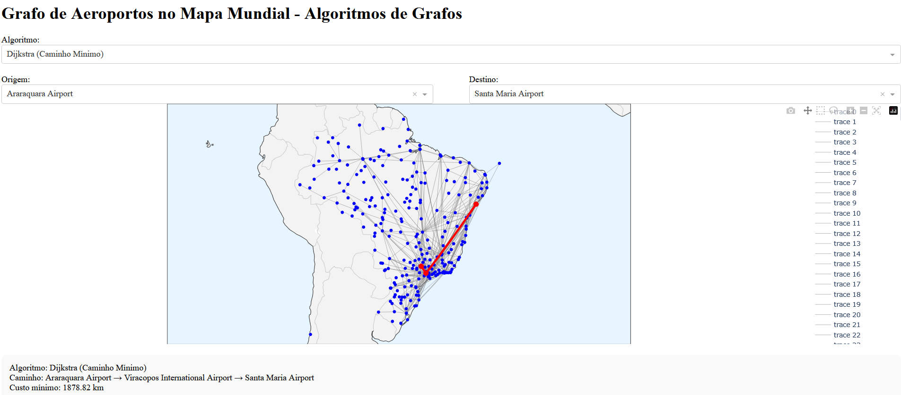
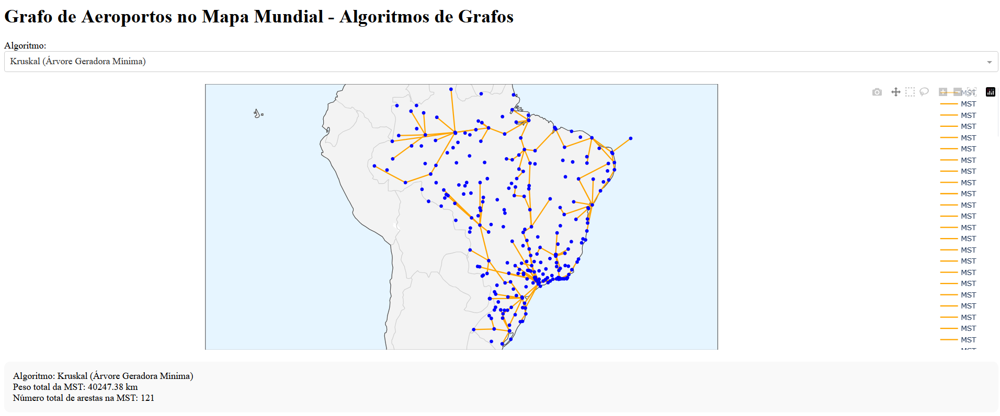

# ALGORITMOS EM GRAFOS — Dijkstra e Kruskal

**Conteúdo da Disciplina**: Grafos 2  

## Alunos

| Matrícula | Aluno |
| -- | -- |
| 231026901 | Caio Ferreira Duarte |
| 211029601 | Victor Pontual Guedes Arruda Nobrega |

## Sobre
Este repositório é um **incremento** do trabalho desenvolvido em **Grafos 1 — Interligar Aeroportos**, disponível em:  
https://github.com/projeto-de-algoritmos-2025/Grafos1_InterligarAeroportos

O projeto utiliza um **dataset de aeroportos e suas conexões** para aplicar algoritmos clássicos de grafos. O **algoritmo de Dijkstra** é empregado para encontrar o **menor caminho em quilômetros** entre dois aeroportos, enquanto o **algoritmo de Kruskal** é utilizado para determinar a **árvore geradora mínima (MST)** da rede, conectando todos os aeroportos com o menor custo total possível.

## Algoritmos (visão geral)

### Dijkstra — Menor Caminho
O algoritmo de Dijkstra resolve o problema do menor caminho a partir de um vértice origem em um grafo ponderado com pesos não negativos.


### Kruskal — Árvore Geradora Mínima
O algoritmo de Kruskal encontra uma árvore geradora mínima em um grafo ponderado e não direcionado.

## Exemplo de Uso

Aeroporto de origem: GRU Aeroporto de destino: JFK

Menor distância encontrada: 7685 km Caminho: GRU -> MIA -> JFK

Custo total da árvore geradora mínima: 123456 km

Obs: Os valores apresentados são ilustrativos e dependem do dataset utilizado.

## Screenshots
Exemplo da execução do Djikstra:

<p align="center">
  
</p>

Exemplo da execução do Kruskal:
<p align="center">
  
</p>

## Instalação
Requisitos:
- Python 3.8+

Passos:
1. Clonar o repositório.
2. (Opcional) Criar e ativar um ambiente virtual.

```powershell
python -m venv .venv
./.venv/Scripts/Activate.ps1
```
Uso

1. Abra um terminal na pasta do projeto.


2. Execute:

```

python main.py
```

## Apresentação

Vídeo disponível em:
https://youtu.be/yI_kjr9UTKI
